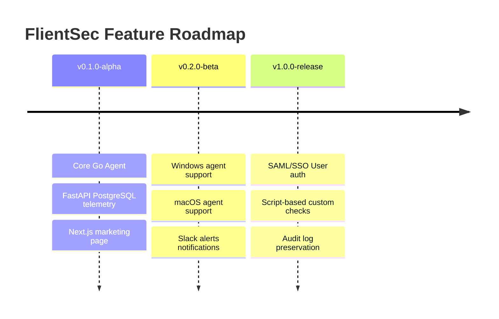

# Product Roadmap

This document outlines upcoming capabilities and releases planned for the FlientSec platform.

---

## 🗺️ Visual Feature Timeline

---

## Planned Enhancements Details

Refer to our complete [Roadmap Guide](docs/roadmap.md) for architecture plans:
- **v0.2.0-beta:** Multi-platform expansion (Windows, macOS), telemetry hooks, and real-time Slack/Teams compliance alerts.
- **v1.0.0-release:** Enterprise-grade security additions (SAML Single Sign-On, custom data retention periods, audit history database exports).
